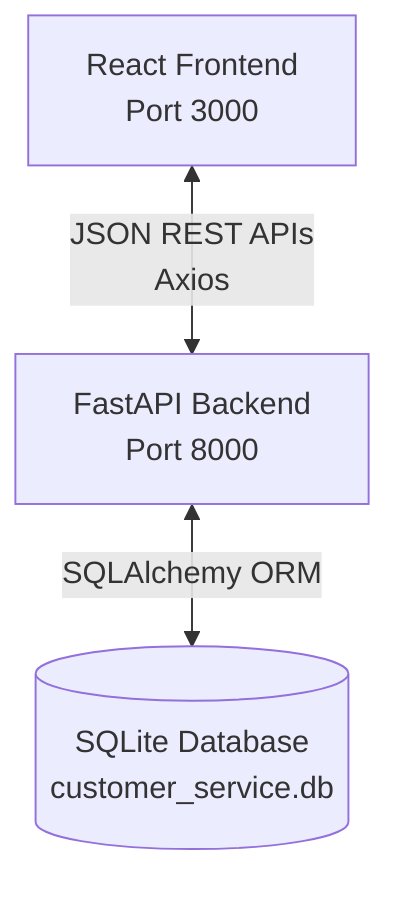
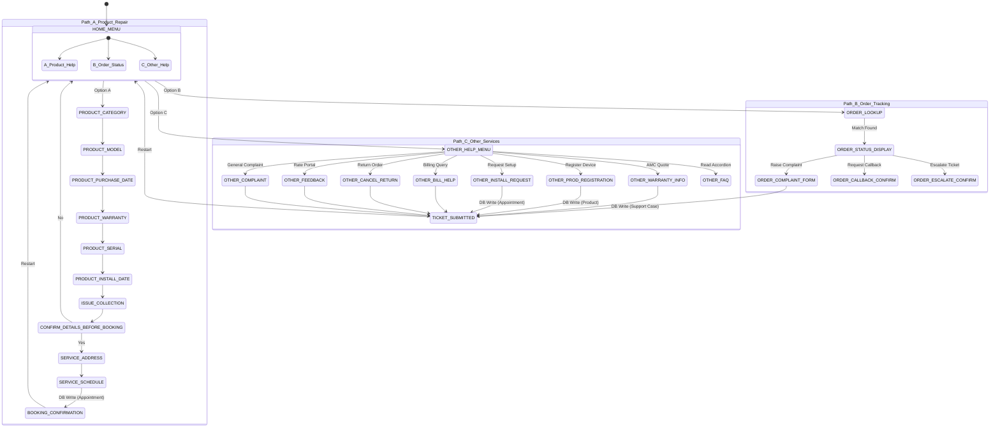
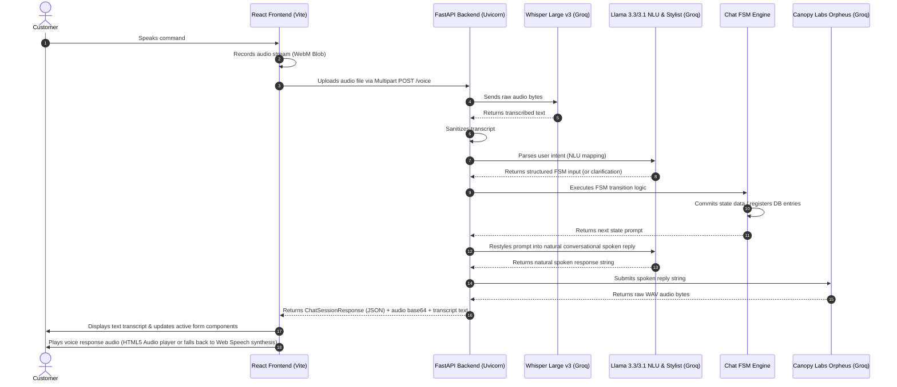

# System Architecture

This document describes the architectural layout, component interactions, and Guided FSM state machine transitions.

---

## 1. Architectural Overview

The portal uses a decoupled **client-server** architecture.

* **Frontend Client:** Built using React + TypeScript, bundled with Vite. Styled with Tailwind CSS, utilizing Framer Motion for micro-animations and smooth layout transitions. Runs on port 3000.
* **Backend Server:** Built using FastAPI, served via Uvicorn. Validates payloads using Pydantic schemas. Runs on port 8000.
* **Database Layer:** A local SQLite relational database storing user records, registrations, appointments, tickets, and active chat logs.

---

## 2. Guided Support FSM (Finite State Machine)

The chatbot diagnostic journey acts as a state machine where each user input transitions the session to a new node, culminating in service appointments or tickets.

* **Step Back Navigation:** Pushing previous state tags onto `state_history` lets users revert transitions by popping state tags and restoring previous chat data.

---

## 3. Voice Pipeline Sequence

The voice dialogue features follow a sequential, decoupled pipeline:

* **Interruption Handling:** The frontend monitors user actions (microphone clicks, keyboard typing) and instantly stops active HTML5 audio playback (or browser SpeechSynthesis) to ensure smooth, natural pacing.
* **Deterministic Fallback:** If Groq services fail or rate-limit requests, the backend falls back to local regex-based parsing rules and standard text responses.
* **SpeechSynthesis Fallback (Client-Side):** If the backend TTS generation fails (e.g. because terms need to be accepted on Groq Console, rate limits, or connectivity errors) or the generated audio file fails to load/play in the browser, the frontend automatically falls back to speaking the bot's reply using the browser's native **Web Speech API (`window.speechSynthesis`)**. This provides full resilience and robust client-side voice replies.
